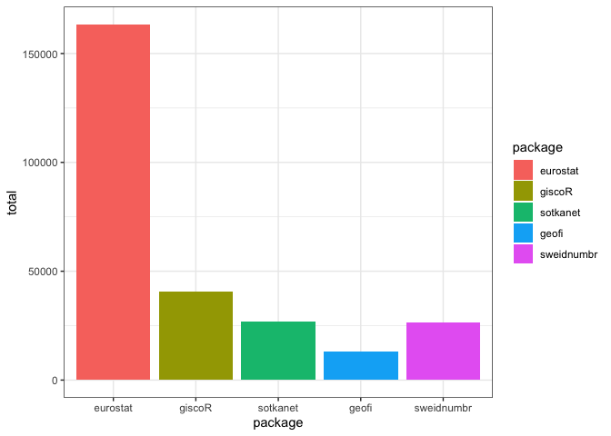

<!-- README.md is generated from README.Rmd. Please edit that file -->

<!-- badges: start -->

[](http://ropengov.org/)
[](https://github.com/rOpenGov/sorvi/actions)
[](https://CRAN.R-project.org/package=sorvi)
[](http://github.com/badges/stability-badges)
[](https://github.com/ropengov/sorvi/watchers)
[](https://github.com/ropengov/sorvi/stargazers)
[](https://twitter.com/intent/follow?screen_name=ropengov)
[](https://CRAN.R-project.org/package=sorvi)
<!-- badges: end -->

# sorvi<a href="https://ropengov.github.io/sorvi/"></a>

sorvi package was originally intended for hosting various algorithms for
Finnish open goverment data in [R](http://www.r-project.org). Now it
hosts various functions that are helpful in package maintenance and
authoring but do not fit in other, more specialized packages.

## Installation

You can install the development version of sorvi from
[GitHub](https://github.com/) with:

``` r
# install.packages("devtools")
devtools::install_github("rOpenGov/sorvi")
```

## Using the package

Loading the package in R:

``` r
library(sorvi)
```

Get download statistics of eurostat-package, by year:

``` r
df <- cran_downloads(pkgs = "eurostat", sum = "by_year", use.cache = FALSE)
df
#> # A tibble: 5 × 3
#> # Groups:   year [5]
#>    year package      n
#>   <dbl> <fct>    <int>
#> 1  2016 eurostat  6419
#> 2  2017 eurostat 12482
#> 3  2018 eurostat 18932
#> 4  2019 eurostat 28454
#> 5  2020 eurostat 31298
```

Get download statistics of various rOpenGov packages over time and draw
a chart:

``` r
plot <- cran_downloads(pkgs = c("eurostat", "giscoR", "sotkanet", "geofi", "sweidnumbr"), sum = "total", output = "plot", use.cache = FALSE)
plot
```



For more examples, check the [tutorial
page](https://ropengov.github.io/sorvi/articles/sorvi_tutorial.html).

## Contributing

  - [Submit suggestions and bug
    reports](https://github.com/ropengov/sorvi/issues) (provide the
    output of `sessionInfo()` and `packageVersion("sorvi")` and
    preferably provide a [reproducible
    example](http://adv-r.had.co.nz/Reproducibility.html))
  - [Send a pull request](https://github.com/ropengov/sorvi/)
  - [Star us on the Github page](https://github.com/ropengov/sorvi/)
  - [See our website](http://ropengov.org/community/) for additional
    contact information

## Acknowledgements

**Kindly cite this work** as follows: [Leo
Lahti](http://github.com/antagomir/), Juuso Parkkinen, Joona Lehtomäki,
Jussi Paananen, Einari Happonen, Juuso Haapanen, Pyry Kantanen. sorvi -
Finnish Open Government Data Toolkit. URL:
<http://ropengov.github.io/sorvi/>

We are grateful to all
[contributors](https://github.com/rOpenGov/sorvi/graphs/contributors)\!
This project is part of [rOpenGov](http://ropengov.org).
