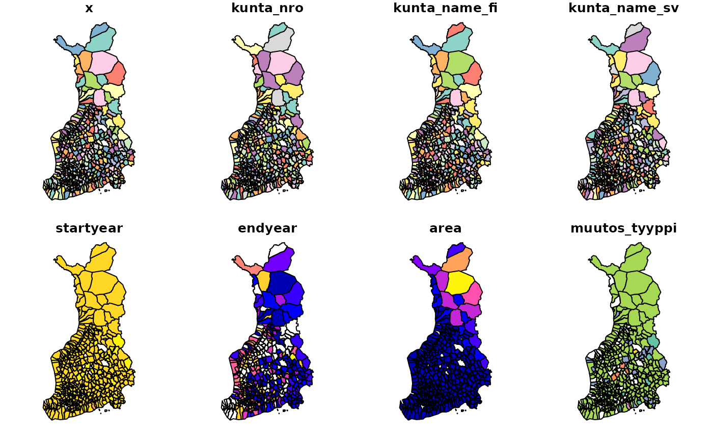
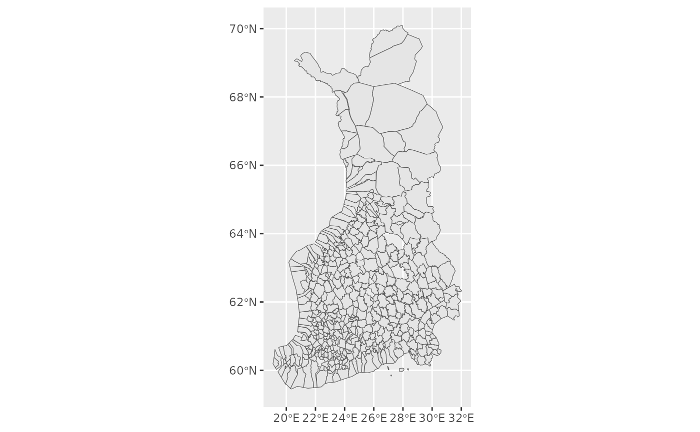

# Finnish historical maps with sorvi R package

## Finnish historical maps with sorvi

### Introduction

Accessing high-quality shapefiles and other vectorized geospatial
location boundaries for different administrative divisions is nowadays
trivial as datasets are readily available through download services and
APIs. Packages such as [geofi/](https://ropengov.github.io/geofi/) and
[giscoR](https://ropengov.github.io/giscoR/) make it easy to draw maps
in the case of Finland and European NUTS areas and visualize statistical
data in the form of choropleth maps.

However, when it comes to historical boundaries such as Finnish
municipality boundaries before the year 2013, drawing maps becomes
harder. For example, the National Land Survey of Finland offers
municipality-based boundaries only for the current year and Statistics
Finland offers maps only from 2013 onwards. From 2005 to 2022 only,
Finnish municipalities have undergone 79 merger processes with their
number falling from 431 to 309, or approximately one-fourth. In time
series data municipality mergers are taken into account by the
Statistics Authorities, making it possible to see how current
municipalities and their parts combined have developed in the past. In
most cases, Statistics Finland uses the current municipality division as
the basis of population statistics time series.

### Previous work

In 2003-2012 [FinnONTO
project](https://seco.cs.aalto.fi/projects/finnonto/) driven by the
[Semantic Computing Research Group (SeCo)](https://seco.cs.aalto.fi)
started with the ambition of laying the foundations “for a national
metadata, ontology, ontology service, and linked data framework in
Finland”. As part of the project [National Ontology Service
ONKI](http://onki.fi) was published in 2008, which was used to publish
“interlinked, collaboratively created ontologies and vocabularies in a
centralized way, with 150 organizations as registered users.

As part of the FinnONTO project, the [Finnish Spatio-Temporal Ontology
(SAPO)](https://seco.cs.aalto.fi/ontologies/sapo/) was created. SAPO is
an “ontology time series of Finnish municipalities over the time
interval 1865-2010” and as an ontology, it “represents knowledge about
changes (e.g. merges, splits) in historical regions (e.g. cities,
counties)”. The types of changes include (from [Väätäinen & Kauppinen
2015](https://urn.fi/URN:ISBN:978-951-51-1422-8), Finnish terms in
parentheses):

- **establishing** a completely new municipality (*perustaminen*);
- **abolishing** a municipality (*lakkauttaminen*);
- **splitting** one municipality into two or more municipalities
  (*jakaantuminen*);
- **merging** two or more municipalities into a single municipality
  (*yhdistyminen*);
- changing the ownership of a part of a municipality to another
  (*aluesiirto*);
- **changing the name** of the municipality (*nimenmuutos*);
- **ceding** a municipality or part of a municipality to another
  sovereign state, effectively abolishing the municipality entity in the
  original country (*alueluovutus*);
- **integrating** (the opposite of ceding territory) a municipality from
  another sovereign state, effectively meaning that a new administrative
  area must be established in the receiving country (*aluesaaminen*);
- **establishing new administrative area from the parts of two or more
  other areas** (*aluesiirtoperustaminen*);
- **dividing existing administrative area between two or more existing
  administrative areas** (*aluesiirtojakaantuminen*);
- **renting out certain area** to the use of another sovereign state
  (*aluevuokraus*);
- **ending the rental period** of land area and returning it into
  sovereign rule (*aluevuokrauksen loppuminen*);
- **formation**, in the case of administrative areas (or settlements)
  that have gradually started to exist without any specific founding
  date (*muodostuminen*);
- **demarcation**, when areas are divided between two neighbouring
  administrative areas that didn’t previously have clearly defined
  borders (*rajanveto*).

In practice, all Finnish municipalities have a set establishment date.
Most municipalities were established in 1865 with His Imperial Majesty’s
Degree on Municipal Administration in the Countryside (more information
in [Wikipedia (in
Finnish)](https://fi.wikipedia.org/w/index.php?title=Vuoden_1865_kunnallisasetus&oldid=18611717),
degree AsK 4/1865 text in [Wikisource (in
Finnish)](https://fi.wikisource.org/wiki/Asetus_kunnallishallituksesta_maalla_1865)),
that moved secular administration away from church parishes to newly
established municipalities. Many municipalities have also changed names
at some point, been split or merged, and had border changes with their
neighbouring municipalities. Ceding or abolishing municipalities is
mostly related to the situation after the Second World War when many
Finnish municipalities in Karelia were ceded to the Soviet Union.

Since 2008, ONKI has been superseded by [Finto](https://finto.fi/en/),
although it does not contain all the data that ONKI did. I have used
data files (RDF/Turtle files) downloaded from ONKI as a starting point
and created datasets that feel more natural for an R user to use, using
[rdflib](https://cran.r-project.org/package=rdflib) R package.

### Drawing historical maps

Historical maps can be drawn simply by using the
[`get_municipalities()`](https://ropengov.github.io/sorvi/reference/get_municipalities.md)
function.

``` r
library(sorvi)
#> sorvi - Tools for Finnish Open Data.
#> Copyright (C) 2010-2023 Leo Lahti, Juuso Parkkinen, Joona Lehtomaki and Pyry Kantanen 
#> 
#> http://github.com/ropengov/sorvi 
#> 
#>  Hard sciences are successful because they deal with soft problems; 
#>  soft sciences are struggling because they deal with hard problems.
#> -                        Von Foerster

x <- get_municipalities(year = 1912)
head(x)
#> Simple feature collection with 6 features and 8 fields
#> Geometry type: POLYGON
#> Dimension:     XY
#> Bounding box:  xmin: 20.88007 ymin: 60.87673 xmax: 24.76896 ymax: 66.30193
#> Geodetic CRS:  ISN93
#> # A tibble: 6 × 9
#> # Groups:   kunta_nro [6]
#>   x                kunta_nro kunta_name_fi kunta_name_sv startyear endyear  area
#>   <chr>            <chr>     <chr>         <chr>             <dbl>   <int> <dbl>
#> 1 http://www.yso.… 001       Ahlainen      Ahlainen           1908    1971  185 
#> 2 http://www.yso.… 003       Akaa          Akaa               1895    1931  131 
#> 3 http://www.yso.… 004       Alahärmä      Alahärmä           1867    2008  351.
#> 4 http://www.yso.… 005       Alajärvi      Alajärvi           1868    2008  737.
#> 5 http://www.yso.… 006       Alastaro      Alastaro           1869    2008  257.
#> 6 http://www.yso.… 007       Alatornio     Nedertorneå        1865    1956  868 
#> # ℹ 2 more variables: muutos_tyyppi <chr>, geometry <POLYGON [°]>
```

The municipalities can be plotted with base R functions or with ggplot2.

``` r
plot(x)
```



``` r

library(ggplot2)
ggplot(x) + geom_sf()
```

 For
more interesting mapping examples, I recommend readers to acquaintance
themselves e.g. with the [geofi
packages](https://ropengov.github.io/geofi/index.html) articles on
[making
maps](https://ropengov.github.io/geofi/articles/geofi_making_maps.html),
[joining attribute data with geospatial
objects](https://ropengov.github.io/geofi/articles/geofi_joining_attribute_data.html)
or [spatial data
analysis](https://ropengov.github.io/geofi/articles/geofi_spatial_analysis.html).
The
[`sorvi::kunnat1865_2021`](https://ropengov.github.io/sorvi/reference/kunnat1865_2021.md)
dataset in sorvi consists of sf objects which are analogous to the more
recent objects downloaded by the geofi package.

### Future work

As can be seen from the visualizations above, there are some gaps in the
data. For example, the dataset metadata for the year 1912 shows that it
has 49 empty geometries:

    Simple feature collection with 520 features and 8 fields (with 49 geometries empty)
    Geometry type: GEOMETRY
    Dimension:     XY
    Bounding box:  xmin: 19.08318 ymin: 59.45416 xmax: 32.019 ymax: 70.09204
    Geodetic CRS:  ISN93
    # A tibble: 520 × 9
    # Groups:   kunta_nro [520]

In addition, there are some inconsistencies with the geometries compared
to newer datasets downloaded from the National Land Survey of Finland /
Statistics Finland API. For example, municipalities that are surrounded
by rural municipalities (“maalaiskunta”) can sometimes be left under the
rural municipality polygon if the rural municipality polygon is too
simplified and has no holes. Similarly, some municipality enclaves or
exclaves might not be properly represented as the borders of the
municipalities are rather simplified. However, it must be noted that
small-scale information like this is not essential for drawing
choropleth maps and visualizing the broad strokes of municipality
administration development in Finland.

Additionally, having access to historical maps does not mean that much
else could be done with them without having access to some other type of
data. Statistics Finland has published data on the Finnish population
from 1750 onwards in their statistical database that can be accessed
e.g. with the [pxweb R package](https://ropengov.github.io/pxweb/), but
regrettably, this data is only at a national level. Publications such as
Suomen Tilastollinen Vuosikirja (Finnish Statistical Yearbook, [example
from 1918](https://urn.fi/URN:NBN:fi-fe2023013124885)) might be
interesting sources of information if someone has the time and resources
to digitize tables from there. Utilizing [HisKi
database](https://hiski.genealogia.fi) that contains digitized parish
record data would also be interesting, although the oldest parish
records are much older than the oldest municipalities. This would again
prompt the need to map out parish district borders if such well-defined
borders ever existed.

It is therefore evident that much work is still to be done. Users are
welcome to fill data gaps or provide better polygons! [Opening an
issue](https://github.com/rOpenGov/sorvi/issues) in GitHub or directly
[making a pull request](https://github.com/rOpenGov/sorvi/pulls) is very
much appreciated. Suggestions regarding the best possible practices and
solutions for data and metadata storage are also welcome.

### Attribution

Raw data downloaded from ONKI.fi website on 04 Aug 2022:
<http://onki.fi/en/browser/overview/sapo>

Data attribution: FinnONTO Consortium:
<https://seco.cs.aalto.fi/projects/finnonto/>

### References

- Kauppinen, Tomi & Väätäinen, Jari. 2015. SAPOn nykytila, ylläpito ja
  laajennusmahdollisuudet. Raportteja ja selvityksiä 1/2015,
  Kansalliskirjasto. URN: <https://urn.fi/URN:ISBN:978-951-51-1422-8>
- Tilastokeskus. 1999. Väestötilastoja 250 vuotta: Katsaus
  väestötilaston historiaan vuosina 1749–1999. Väestö 1999:8, SVT. URN:
  <https://urn.fi/URN:NBN:fi-fe2023013112911>
