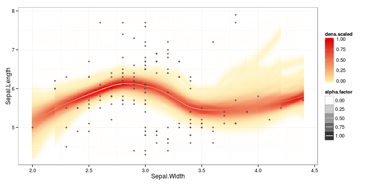

<!--
%\VignetteEngine{knitr::rmarkdown}
%\VignetteIndexEntry{sorvi Markdown Vignette}
%\usepackage[utf8]{inputenc}
-->


Finnish open government data toolkit for R
===========

This R package provides miscellaneous tools for Finnish open
government data. Your
[contributions](http://ropengov.github.io/contribute/), [bug reports
and other feedback](https://github.com/ropengov/sorvi) are welcome!


## Available data sources and tools

[Installation](#installation) (Asennus)  

[Finnish provinces](#provinces) (Maakuntatason informaatio)

* [Basic province information](#provinceinfo) (Area, Population, Population Density)
* [Finnish-English province name translations](#provincetranslations)  

[Finnish municipalities](#municipality) (Kuntatason informaatio)

* [Land Survey Finland](#mml) (Maanmittauslaitos / MML)

[ID conversion tools](#conversions)

* [Municipality-Postal code conversions](#postalcodes) (Kunnat vs. postinumerot)  
* [Municipality name-ID conversions](#municipalityconversions) (Kunnat vs. kuntakoodit)
* [Municipality-province conversions](#municipality2province) (Kunnat vs. maakunnat)
* [Generic synonyme converter](#synonymes) (Synonyymit)

[Finnish personal identification number (HETU)](#hetu) (Henkilotunnuksen kasittely)  

[Visualization tools](#visualization) (Visualisointirutiineja)  

See also [other rOpenGov packages](http://ropengov.github.io/projects), in particular:

 * [gisfin](https://github.com/rOpenGov/gisfin/) Visualization of Finnish geographic information 
 * [helsinki](https://github.com/rOpenGov/helsinki/) Helsinki open data tools 
 * [sotkanet](https://github.com/rOpenGov/sotkanet/) THL Sotkanet database on health and demography
 * [pxweb](https://github.com/rOpenGov/pxweb/) PX-Web interface to access data fom Statistics Finland and other PX-Web compliant sources
 * [finpar](https://github.com/rOpenGov/finpar/) Finnish parliament data


## <a name="installation"></a>Installation

We assume you have installed [R](http://www.r-project.org/). If you
use [RStudio](http://www.rstudio.com/ide/download/desktop), change the
default encoding to UTF-8. Linux users should also install
[CURL](http://curl.haxx.se/download.html).

Install the stable release version in R:


```r
install.packages("sorvi")
```

Test the installation by loading the library:


```r
library(sorvi)
```

Development version for developers:


```r
library(devtools)
install_github("ropengov/sorvi")
```

We also recommend setting the UTF-8 encoding:


```r
Sys.setlocale(locale="UTF-8") 
```

Brief examples of the package tools are provided below. Further
examples are available in [Louhos-blog](http://louhos.wordpress.com)
and in our [Rmarkdown blog](http://louhos.github.io/archive.html).


## <a name="provinces"></a>Province information (Maakunnat)


### <a name="provincetranslations"></a>Finnish-English translations

**Finnish-English translations for province names** (we have not been able
to solve all encoding problems yet; solutions welcome!):


```r
translations <- load_sorvi_data("translations")
```

```
## Error: the input does not start with a magic number compatible with loading from a connection
```

```r
head(as.matrix(translations))
```

```
## Error in as.matrix(translations): object 'translations' not found
```


## <a name="municipality"></a>Municipality information

Finnish municipality information is available through Statistics
Finland (Tilastokeskus; see
[stafi](https://github.com/ropengov/statfi) package) and Land Survey
Finland (Maanmittauslaitos). The row names for each data set are
harmonized and can be used to match data sets from different sources,
as different data sets may carry different versions of certain
municipality names.

### <a name="mml"></a>Land Survey Finland (municipality information)

Source: [Maanmittauslaitos, MML](http://www.maanmittauslaitos.fi/aineistot-palvelut/latauspalvelut/avoimien-aineistojen-tiedostopalvelu). 


```r
municipality.info.mml <- get_municipality_info_mml()
```

```
## Error: the input does not start with a magic number compatible with loading from a connection
```

```r
library(knitr)
kable(municipality.info.mml[1:2,])
```

```
## Error in is.data.frame(x): object 'municipality.info.mml' not found
```


## <a name="conversions"></a>Conversions


### <a name="municipality2province"></a>Municipality-Province mapping

**Map all municipalities to correponding provinces**


```r
m2p <- municipality_to_province() 
```

```
## Error: the input does not start with a magic number compatible with loading from a connection
```

```r
kable(head(m2p)) # Just show the first ones
```

```
## Error in head(m2p): object 'm2p' not found
```

**Map selected municipalities to correponding provinces:**


```r
municipality_to_province(c("Helsinki", "Tampere", "Turku")) 
```

```
## Error: the input does not start with a magic number compatible with loading from a connection
```

**Speed up conversion with predefined info table:**


```r
m2p <- municipality_to_province(c("Helsinki", "Tampere", "Turku"), municipality.info.mml)
```

```
## Error in municipality_to_province(c("Helsinki", "Tampere", "Turku"), municipality.info.mml): object 'municipality.info.mml' not found
```

```r
kable(head(m2p))
```

```
## Error in head(m2p): object 'm2p' not found
```


### <a name="municipalityconversions"></a>Municipality name-ID conversion

**Municipality name to code**


```r
convert_municipality_codes(municipalities = c("Turku", "Tampere"))
```

**Municipality codes to names**


```r
convert_municipality_codes(ids = c(853, 837))
```

**Complete conversion table**


```r
municipality_ids <- convert_municipality_codes()
kable(head(municipality_ids)) # just show the first entries
```


### <a name="synonymes"></a>Synonyme conversions

Generic conversion of synonymes into harmonized terms.

First, get a synonyme-name mapping table. In this example we harmonize Finnish municipality names that have multiple versions. But the synonyme list can be arbitrary.


```r
f <- system.file("extdata/municipality_synonymes.csv", package = "sorvi")
synonymes <- read.csv(f, sep = "\t")		 
```

Validate the synonyme list and add lowercase versions of the terms:


```r
synonymes <- check_synonymes(synonymes, include.lowercase = TRUE)
```

Convert the given terms from synonymes to the harmonized names:


```r
harmonized <- harmonize_names(c("Mantta", "Koski.Tl"), synonymes)
kable(harmonized)
```


## <a name="hetu"></a>Personal identification number (HETU)

**Extracting information from a Finnish personal identification number**


```r
library(sorvi)
hetu("111111-111C")
```

```
##          hetu gender personal.number checksum       date day month year
## 1 111111-111C   Male             111        C 1911-11-11  11    11 1911
##   century.char
## 1            -
```

The function accepts also vectors as input, returning a data frame:


```r
library(knitr)
kable(hetu(c("010101-0101", "111111-111C")))
```


|hetu        |gender | personal.number|checksum |date       | day| month| year|century.char |
|:-----------|:------|---------------:|:--------|:----------|---:|-----:|----:|:------------|
|010101-0101 |Female |              10|1        |1901-01-01 |   1|     1| 1901|-            |
|111111-111C |Male   |             111|C        |1911-11-11 |  11|    11| 1911|-            |

**Extracting specific field**


```r
hetu(c("010101-0101", "111111-111C"), extract = "gender")
```

```
## [1] "Female" "Male"
```

**Validate Finnish personal identification number:**


```r
valid_hetu("010101-0101") # TRUE/FALSE
```

```
## [1] TRUE
```


## <a name="visualization"></a>Visualization tools

Draw regression curve with smoothed error bars based on
the [Visually-Weighted Regression](http://www.fight-entropy.com/2012/07/visually-weighted-regression.html) by Solomon M. Hsiang. The sorvi implementation extends [Felix Schonbrodt's original code](http://www.nicebread.de/visually-weighted-watercolor-plots-new-variants-please-vote/).


```r
library(sorvi) 
data(iris)
p <- regression_plot(Sepal.Length ~ Sepal.Width, iris) 
print(p)
```

 

### TODO

[TODO list of further data
sources](https://github.com/rOpenGov/sorvi/blob/master/vignettes/todo-datasets.md)


## Licensing and Citations

This work can be freely used, modified and distributed under the 
[Two-clause BSD license](http://en.wikipedia.org/wiki/BSD\_licenses).


```r
citation("sorvi")
```

```
## 
## Kindly cite the sorvi R package as follows:
## 
##   (C) Leo Lahti, Juuso Parkkinen, Joona Lehtomaki, Juuso Haapanen,
##   Einari Happonen and Jussi Paananen (rOpenGov 2010-2015).  sorvi:
##   Finnish open data toolkit for R.  URL:
##   http://ropengov.github.com/sorvi
## 
## A BibTeX entry for LaTeX users is
## 
##   @Misc{,
##     title = {sorvi: Finnish open government data toolkit for R},
##     author = {Leo Lahti and Juuso Parkkinen and Joona Lehtomaki and Juuso Haapanen and Einari Happonen and Jussi Paananen},
##     doi = {10.5281/zenodo.10280},
##     year = {2011},
##   }
## 
## Many thanks for all contributors! See: http://ropengov.github.com
```

## Session info

This vignette was created with


```r
sessionInfo()
```

```
## R version 3.2.1 (2015-06-18)
## Platform: x86_64-unknown-linux-gnu (64-bit)
## Running under: Ubuntu 15.04
## 
## locale:
##  [1] LC_CTYPE=en_US.UTF-8       LC_NUMERIC=C              
##  [3] LC_TIME=en_US.UTF-8        LC_COLLATE=en_US.UTF-8    
##  [5] LC_MONETARY=en_US.UTF-8    LC_MESSAGES=en_US.UTF-8   
##  [7] LC_PAPER=en_US.UTF-8       LC_NAME=C                 
##  [9] LC_ADDRESS=C               LC_TELEPHONE=C            
## [11] LC_MEASUREMENT=en_US.UTF-8 LC_IDENTIFICATION=C       
## 
## attached base packages:
## [1] stats     graphics  grDevices utils     datasets  methods   base     
## 
## other attached packages:
## [1] sorvi_0.7.26       knitr_1.10.5       scimapClient_0.2.1
## 
## loaded via a namespace (and not attached):
##  [1] Rcpp_0.11.6        magrittr_1.5       MASS_7.3-41       
##  [4] munsell_0.4.2      colorspace_1.2-6   R6_2.0.1          
##  [7] highr_0.5          stringr_1.0.0      plyr_1.8.3        
## [10] dplyr_0.4.2        tools_3.2.1        parallel_3.2.1    
## [13] grid_3.2.1         gtable_0.1.2       DBI_0.3.1         
## [16] lazyeval_0.1.10    assertthat_0.1     digest_0.6.8      
## [19] RJSONIO_1.3-0      RColorBrewer_1.1-2 reshape2_1.4.1    
## [22] ggplot2_1.0.1      formatR_1.2        evaluate_0.7      
## [25] labeling_0.3       stringi_0.5-2      scales_0.2.5      
## [28] proto_0.3-10
```


