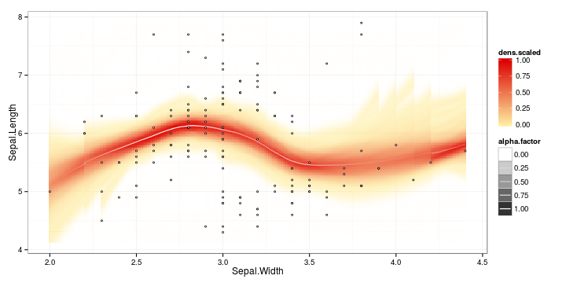

<!--
%\VignetteEngine{knitr::knitr}
%\VignetteIndexEntry{sorvi Markdown Vignette made with knitr}

Joissakin esimerkeissa tarvittavat riippuvuudet 
	<a href="http://trac.osgeo.org/gdal/wiki/DownloadSource">GDAL</a>, 
	<a href="http://freeglut.sourceforge.net/">freeglut</a>, 
	<a href="http://xmlsoft.org/downloads.html">XML</a>, 
	<a href="http://trac.osgeo.org/geos">GEOS</a> ja 
	<a href="http://trac.osgeo.org/proj">PROJ.4</a>. 

-->

Finnish open government data toolkit for R
===========

sorvi provides miscellaneous tools for Finnish open government data to
complement other [rOpenGov](http://ropengov.github.io/projects)
packages with a more specific scope. We also maintain a [todo
list of further data sources](https://github.com/rOpenGov/sorvi/blob/master/vignettes/todo-datasets.md) to be added; your
[contributions are
welcome](http://louhos.github.com/contact.html). For further
information, see the [home page](http://louhos.github.com/sorvi).


### Available data sources and tools

 * [Installation](#installation) (Asennus)
 * [Finnish population register](#populationregister) (Vaestorekisteri)
 * [Finnish postal codes](#postalcodes) (Postinumerodata)
 * [Finnish municipalities](#municipality) (Kuntatason informaatio)
 * [Finnish provinces](#provinces) (Maakuntatason informaatio)
 * [Translations](#translations) (Suomi-Englanti-kaannoksia)
 * [IP address geographic coordinates](#ip) (IP-osoitteen koordinaatit)
 * [Finnish personal identification number (HETU)](#hetu) (Henkilotunnuksen kasittely)
 * [Visualization tools](#visualization) (Visualisointirutiineja)


### <a name="installation"></a>Installation

We assume you have installed [R](http://www.r-project.org/). If you
use [RStudio](http://www.rstudio.com/ide/download/desktop), change the
default encoding to UTF-8. Linux users should also install
[CURL](http://curl.haxx.se/download.html).

Install the stable release version in R:


```r
install.packages("sorvi")
```

Test the installation by loading the library:


```r
library(sorvi)
```

We also recommend setting the UTF-8 encoding:


```r
Sys.setlocale(locale="UTF-8") 
```

Brief examples of the package tools are provided below. Further
examples are available in [Louhos-blog](http://louhos.wordpress.com)
and in our [Rmarkdown blog](http://louhos.github.io/archive.html).

### <a name="populationregister"></a>Finnish population register

Municipality-level population information from [Finnish population register](http://vrk.fi/default.aspx?docid=5127&site=3&id=0) (Vaestokeskus): 


```r
df <- get_population_register()
```

```
## Error: could not find function "get_population_register"
```

```r
head(df)
```

```
##                                                   
## 1 function (x, df1, df2, ncp, log = FALSE)        
## 2 {                                               
## 3     if (missing(ncp))                           
## 4         .External(C_df, x, df1, df2, log)       
## 5     else .External(C_dnf, x, df1, df2, ncp, log)
## 6 }
```


### <a name="postalcodes"></a>Postal codes

Finnish postal codes vs. municipalities table from
[Wikipedia](http://fi.wikipedia.org/wiki/Luettelo_Suomen_postinumeroista_kunnittain). The
municipality names are provided also in plain ascii without special
characters:


```r
postal.code.table <- get_postal_code_info() 
```

```
## Error: could not find function "get_postal_code_info"
```

```r
head(postal.code.table)
```

```
## Error: object 'postal.code.table' not found
```


### <a name="municipality"></a>Municipality data

Finnish municipality information is available through Population
Registry (Vaestorekisterikeskus), Statistics Finland (Tilastokeskus)
and Land Survey Finland (Maanmittauslaitos). The row names for each
data set are harmonized and can be used to match data sets from
different sources, as different data sets may carry slightly different
versions of certain municipality names. 

**Land Survey Finland municipality information** ([Maanmittauslaitos, MML](http://www.maanmittauslaitos.fi/aineistot-palvelut/latauspalvelut/avoimien-aineistojen-tiedostopalvelu)). 


```r
municipality.info.mml <- get_municipality_info_mml()
```

```
## Error: could not find function "get_municipality_info_mml"
```

```r
municipality.info.mml[1:2,]
```

```
## Error: object 'municipality.info.mml' not found
```

**Statistics Finland municipality information** ([Tilastokeskus](http://pxweb2.stat.fi/Database/Kuntien%20perustiedot/Kuntien%20perustiedot/Kuntaportaali.px))


```r
library(pxR) # can be installed with install.packages("pxR")
library(reshape) # can be installed with install.packages("reshape")
municipality.info.statfi <- get_municipality_info_statfi()
```

```
## Error: could not find function "get_municipality_info_statfi"
```

```r
municipality.info.statfi[1:2,]
```

```
## Error: object 'municipality.info.statfi' not found
```


**List the province for each municipality in Finland:**

```r
# All municipalities
m2p <- municipality_to_province() 
```

```
## Error: could not find function "municipality_to_province"
```

```r
head(m2p) # Just show the first ones
```

```
## Error: object 'm2p' not found
```

```r
# Selected municipalities
municipality_to_province(c("Helsinki", "Tampere", "Turku")) 
```

```
## Error: could not find function "municipality_to_province"
```

```r
# Speeding up with predefined municipality info table:
m2p <- municipality_to_province(c("Helsinki", "Tampere", "Turku"), municipality.info.mml)
```

```
## Error: could not find function "municipality_to_province"
```

```r
head(m2p)
```

```
## Error: object 'm2p' not found
```

**Convert municipality codes and names** (see
help(convert_municipality_codes) for all options):


```r
# Municipality name to code
convert_municipality_codes(municipalities = c("Turku", "Tampere"))
```

```
## Error: could not find function "convert_municipality_codes"
```

```r
# Municipality codes to names
convert_municipality_codes(ids = c(853, 837))
```

```
## Error: could not find function "convert_municipality_codes"
```

```r
# Complete conversion table
municipality_ids <- convert_municipality_codes()
```

```
## Error: could not find function "convert_municipality_codes"
```

```r
head(municipality_ids) # just show the first entries
```

```
## Error: object 'municipality_ids' not found
```


### <a name="provinces"></a>Province information

Get Finnish province information from [Wikipedia](http://fi.wikipedia.org/wiki/V%C3%A4est%C3%B6tiheys):


```r
tab <- get_province_info_wikipedia()
```

```
## Error: could not find function "get_province_info_wikipedia"
```

```r
head(tab)
```

```
## Error: object 'tab' not found
```

### <a name="translations"></a>Translations

**Finnish-English translations** for province names (we have not been able
to solve all encoding problems yet; suggestions very welcome!):


```r
translations <- load_sorvi_data("translations")
```

```
## Error: could not find function "load_sorvi_data"
```

```r
head(translations)
```

```
## Error: object 'translations' not found
```


### <a name="ip"></a>IP Location

Geographic coordinates for a given IP-address from
[Data Science Toolkit](http://www.datasciencetoolkit.org/):


```r
ip_location("137.224.252.10")
```

```
## Error: could not find function "ip_location"
```

### <a name="hetu"></a>Personal identification number (HETU)

Extract information from a Finnish personal identification number:


```r
library(sorvi)
hetu("111111-111C")
```

```
## $hetu
## [1] "111111-111C"
## 
## $gender
## [1] "Male"
## 
## $personal.number
## [1] 111
## 
## $checksum
## [1] "C"
## 
## $date
## [1] "1911-11-11"
## 
## $day
## [1] 11
## 
## $month
## [1] 11
## 
## $year
## [1] 1911
## 
## $century.char
## [1] "-"
## 
## attr(,"class")
## [1] "hetu"
```

Validate Finnish personal identification number:


```r
valid_hetu("010101-0101") # TRUE/FALSE
```

```
## [1] TRUE
```


### <a name="visualization"></a>Visualization tools

Line fit with confidence smoothers (if any of the required libraries
are missing, install them with the install.packages command in R):


```r
library(sorvi) 
library(plyr)
library(RColorBrewer)
library(reshape)
library(ggplot2)
data(iris)
p <- regression_plot(Sepal.Length ~ Sepal.Width, iris) 
print(p)
```

 


## Licensing and Citations

This work can be freely used, modified and distributed under the 
[Two-clause BSD license](http://en.wikipedia.org/wiki/BSD\_licenses).

Kindly cite the work as follows


```r
citation("sorvi")
```

```
## 
## Kindly cite the sorvi R package as follows:
## 
##   (C) Leo Lahti, Juuso Parkkinen, Joona Lehtomaki, Juuso Haapanen,
##   Einari Happonen and Jussi Paananen (rOpenGov 2011-2014).  sorvi:
##   Finnish open government data toolkit for R.  URL:
##   http://ropengov.github.com/sorvi
## 
## A BibTeX entry for LaTeX users is
## 
##   @Misc{,
##     title = {sorvi: Finnish open government data toolkit for R},
##     author = {Leo Lahti and Juuso Parkkinen and Joona Lehtomaki and Juuso Haapanen and Einari Happonen and Jussi Paananen},
##     year = {2011},
##   }
## 
## Many thanks for all contributors! See:
## http://louhos.github.com/contact.html
```

## Session info

This vignette was created with


```r
sessionInfo()
```

```
## R version 3.1.0 (2014-04-10)
## Platform: x86_64-pc-linux-gnu (64-bit)
## 
## locale:
##  [1] LC_CTYPE=en_US.UTF-8       LC_NUMERIC=C              
##  [3] LC_TIME=en_US.UTF-8        LC_COLLATE=en_US.UTF-8    
##  [5] LC_MONETARY=en_US.UTF-8    LC_MESSAGES=en_US.UTF-8   
##  [7] LC_PAPER=en_US.UTF-8       LC_NAME=C                 
##  [9] LC_ADDRESS=C               LC_TELEPHONE=C            
## [11] LC_MEASUREMENT=en_US.UTF-8 LC_IDENTIFICATION=C       
## 
## attached base packages:
## [1] stats     graphics  grDevices utils     datasets  methods   base     
## 
## other attached packages:
##  [1] ggplot2_1.0.0      RColorBrewer_1.0-5 sorvi_0.6.1       
##  [4] reshape_0.8.5      pxR_0.40.0         plyr_1.8.1        
##  [7] RJSONIO_1.2-0.2    reshape2_1.4       stringr_0.6.2     
## [10] knitr_1.6         
## 
## loaded via a namespace (and not attached):
##  [1] colorspace_1.2-4 digest_0.6.4     evaluate_0.5.5   formatR_0.10    
##  [5] grid_3.1.0       gtable_0.1.2     labeling_0.2     MASS_7.3-33     
##  [9] munsell_0.4.2    proto_0.3-10     Rcpp_0.11.1      scales_0.2.4    
## [13] tools_3.1.0      XML_3.98-1.1
```


